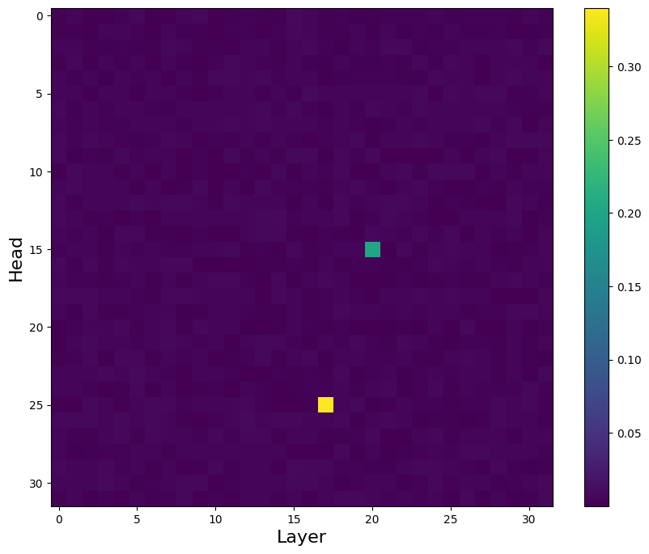
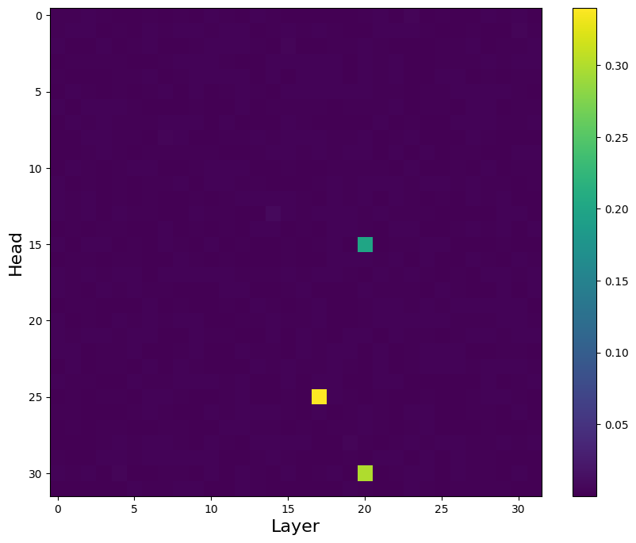
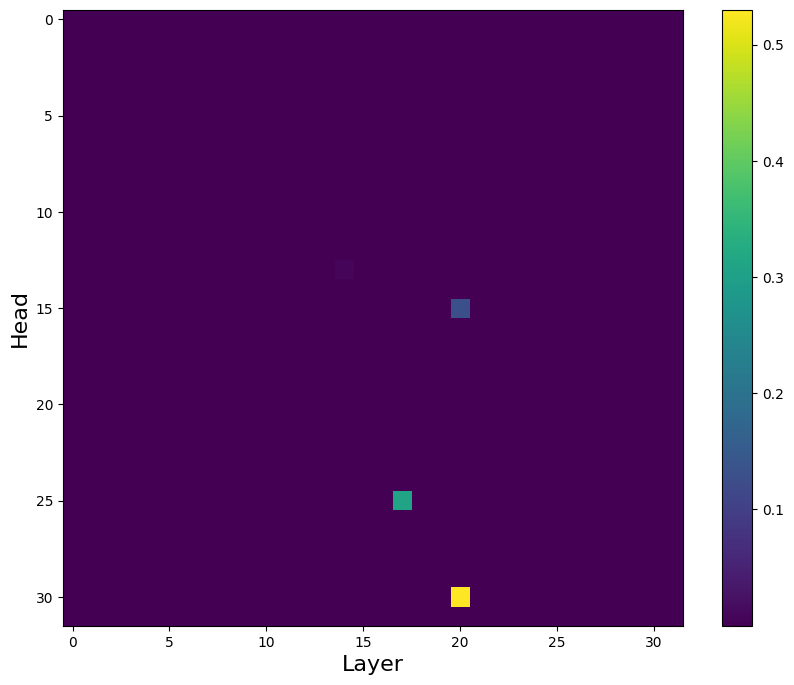

## Causal Analysis Heatmaps

We provide heatmaps illustrating the impact of different sample sizes on causal analysis on Mistral-7B (consistent on the paper). The heatmaps visualize the results across various sample sizes: **1, 2, 5, 15, 50, and 100**.

## Heatmaps

### Sample Size: 1

### Sample Size: 2

### Sample Size: 5

### Sample Size: 15

### Sample Size: 50

### Sample Size: 100

